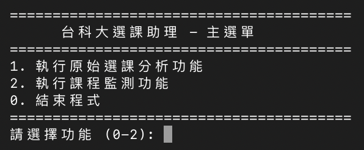
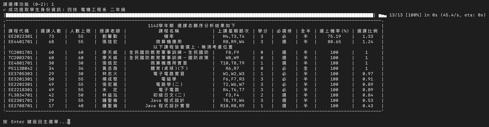
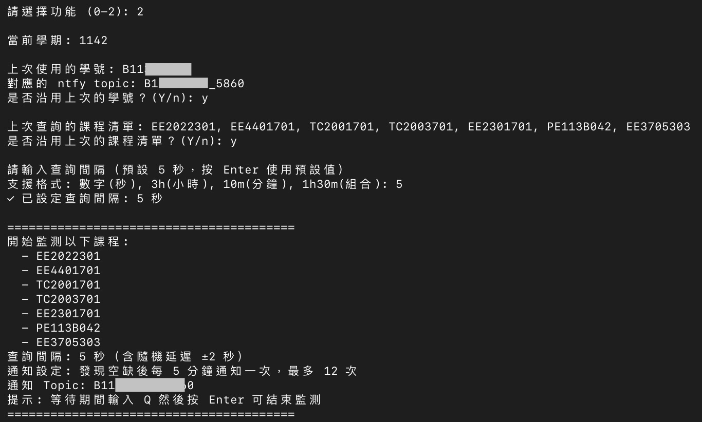
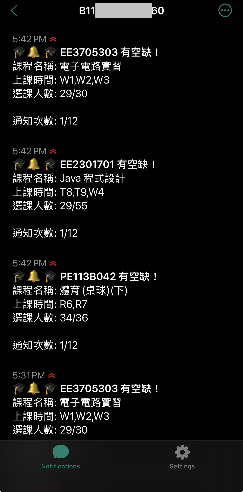
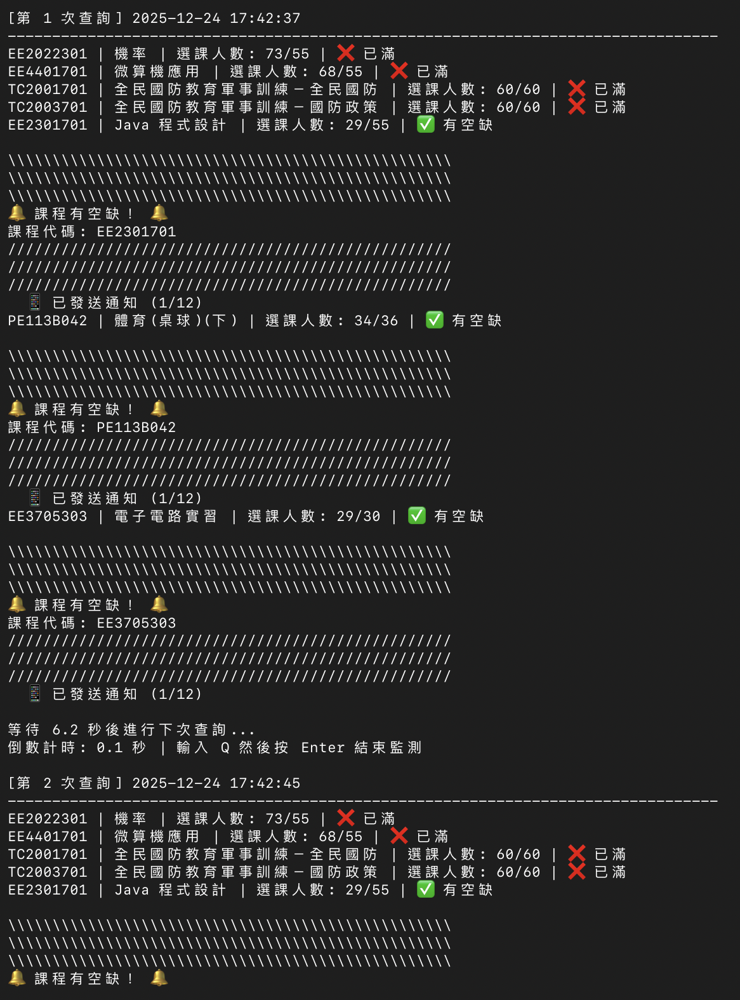
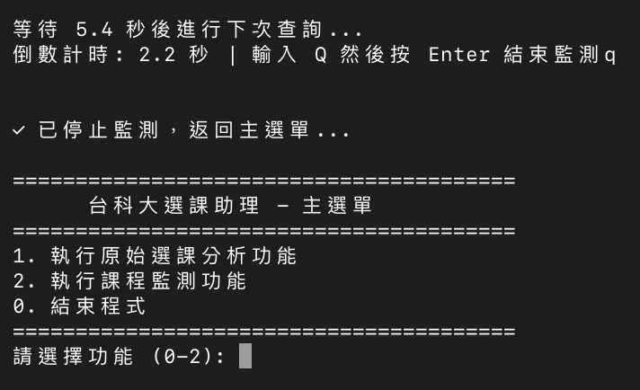

# 台灣科技大學 選課志願序小幫手 🎓

> 為了選到想要的課，你還在一門一門手動查詢嗎？正在猶豫搶手的課程應該怎麼排比較好？

**恭喜你，你找到好東西了！**

這個強大的選課小幫手不僅能自動分析你的選課清單，更提供即時課程監測功能，讓你第一時間掌握課程空缺！

---

## ✨ 主要功能

### 📊 功能一：選課志願序分析
- ✅ 自動解析選課清單 HTML 檔案
- ✅ 批量查詢所有課程的選課人數與限制
- ✅ 智能計算選課比例與成功機率
- ✅ 一鍵了解所有欲選課程的選課狀況
- ✅ 提供清晰的表格化結果

### 🔍 功能二：即時課程監測 ⭐ **最新功能**
- 🔔 **即時監測**：持續追蹤指定課程的選課狀況
- 📱 **手機推送**：透過 ntfy.sh 發送課程空缺通知到手機
- 🔐 **隱私保護**：使用學號加密生成專屬通知 topic
- ⏰ **智能提醒**：發現空缺後每 5 分鐘通知一次（最多 12 次）
- 🎯 **多課程支援**：同時監測多門課程
- 💾 **記憶功能**：自動記住學號和課程清單
- ⌨️ **快速退出**：按 Q 鍵隨時停止監測
- 🕐 **彈性設定**：支援秒/分/小時的查詢間隔（如：5、30m、2h）

---
<!--
## 📥 下載連結

| **Windows** | **Linux** | **MacOS Apple Silicon** | **MacOS Intel Core** |
|:---:|:---:|:---:|:---:|
| [下載](https://github.com/NTUST-Tool/Course-order-assistant/releases/latest/download/Course-order-assistant.exe) | [下載](https://github.com/NTUST-Tool/Course-order-assistant/releases/latest/download/Course-order-assistant-linux.zip) | [下載](https://github.com/NTUST-Tool/Course-order-assistant/releases/latest/download/Course-order-assistant-macos-arm64.zip) | [下載](https://github.com/NTUST-Tool/Course-order-assistant/releases/latest/download/Course-order-assistant-macos-amd64.zip) |

---
-->

## 📖 使用教學

### 🎯 模式一：選課志願序分析

#### 步驟 1：準備選課清單檔案
1. 登入選課系統，打開你的選課清單
   
   

2. 按下 `Ctrl+S`（Mac: `Cmd+S`），存檔類型選擇 **純 HTML**
   
   

#### 步驟 2：執行程式分析

**方法 A：拖曳執行（推薦）**
```
1. 啟動程式
2. 選擇功能 [1] 執行原始選課分析功能
3. 將 HTML 檔案拖曳到程式視窗
```

**方法 B：命令列執行**
```bash
# Windows
Course-order-assistant.exe 選課清單.html

# macOS
./Course-order-assistant 選課清單.html
```


#### 步驟 3：查看分析結果
程式會自動顯示所有課程的詳細資訊：



**結果說明：**
- 📊 **選課比例**：當前選課人數 ÷ 人數上限
- 📈 **選上機率**：根據比例計算的成功率
- ✅ **必選上課程**：選課比例 < 100% 的課程
- ⚠️ **競爭課程**：需要調整志願序的課程

---

### 🔍 模式二：即時課程監測


#### 步驟 1：啟動監測功能
```
1. 執行程式
2. 選擇功能 [2] 執行課程監測功能
```

#### 步驟 2：設定學號（首次使用）
```
請輸入您的學號（用於接收課程空缺通知）: B11XXX345
✓ 學號已設定: B11XXX345
📱 請在手機 ntfy app 中訂閱以下 topic:
   B11XXX345_7f8e2a
   (這個 topic 是由您的學號 + 本機硬體資訊加密生成，確保只有您在這台電腦上能產生相同 topic)
```

> 💡 **為什麼需要學號？**
> - 用於生成專屬的 ntfy.sh 通知 topic
> - 格式：`學號_SHA256後6位`（例如：B11XXX345_7f8e2a）
> - 確保隱私和安全，防止他人誤訂閱或偽造 topic

#### 步驟 3：設定手機通知（首次使用）

**📱 安裝 ntfy app：**
- **Android**：[Google Play Store](https://play.google.com/store/apps/details?id=io.heckel.ntfy)
- **iOS**：[App Store](https://apps.apple.com/app/ntfy/id1625396347)

**🔔 訂閱通知 topic：**
1. 打開 ntfy app

2. 點擊右上角「+」
3. 輸入程式顯示的 topic（例如：`B11XXX345_7f8e2a`）

4. 點擊「訂閱」
5. ✅ 完成！


#### 步驟 4：輸入監測課程
```
請輸入要監測的課程代碼（多個代碼以逗號分隔）: EE2218302,EE3603301,MA1005301

✓ 課程代碼格式正確
```

**支援的輸入格式：**
- ✅ `EE2218302,EE3603301` - 無空格
- ✅ `EE2218302, EE3603301` - 有空格
- ✅ `EE2218302` - 自動轉大寫

#### 步驟 5：設定查詢間隔
```
請輸入查詢間隔（預設 5 秒，按 Enter 使用預設值）
支援格式: 數字(秒), 3h(小時), 10m(分鐘), 1h30m(組合): 
```

**時間格式範例：**
| 輸入 | 說明 | 實際秒數 |
|------|------|---------|
| `5` | 5 秒 | 5 |
| `30` | 30 秒 | 30 |
| `10m` | 10 分鐘 | 600 |
| `1h` | 1 小時 | 3600 |
| `1h30m` | 1.5 小時 | 5400 |
| `2h30m50` | 2 小時 30 分 50 秒 | 9050 |

#### 步驟 6：開始監測

<!-- ```
========================================
開始監測以下課程:
  - EE2218302
  - EE3603301
查詢間隔: 5 秒（含隨機延遲 ±2 秒）
通知設定: 發現空缺後每 5 分鐘通知一次，最多 12 次
通知 Topic: B11XXX345_7f8e2a
提示: 等待期間輸入 Q 然後按 Enter 可結束監測
========================================

[第 1 次查詢] 2025-12-24 14:30:15
--------------------------------------------------------------------------------
EE2218302 | 電子電路 | 選課人數: 45/50 | ✅ 有空缺
  📱 已發送通知 (1/12)
EE3603301 | 信號與系統 | 選課人數: 60/60 | ❌ 已滿

等待 5.2 秒後進行下次查詢...
倒數計時: 5.2 秒 | 輸入 Q 然後按 Enter 結束監測
``` -->


#### 📱 手機收到通知範例
<!-- ```
🎓 EE2218302 有空缺！
課程名稱: 電子電路
上課時間: T6,T7,R4
選課人數: 45/50

通知次數: 1/12
``` -->


#### 課程已滿通知
當有空缺的課程被其他人選滿時：
```
EE3603301 | 信號與系統 | 選課人數: 60/60 | ❌ 已滿
  📱 已發送「課程已滿」通知
```

**手機收到：**
```
❌ EE3603301 已滿額
課程名稱: 信號與系統
上課時間: M6,M7,F4
選課人數: 60/60

該課程已被選滿，請繼續關注其他時段
```

---

## 🚀 進階功能

### 💾 自動記憶功能
程式會自動記住您的設定：

**📌 學號記憶**
```
上次使用的學號: B11XXX345
對應的 ntfy topic: B11XXX345_7f8e2a
是否沿用上次的學號？(Y/n): y
```

**📌 課程清單記憶**
```
上次查詢的課程清單: EE2218302,EE3603301
是否沿用上次的課程清單？(Y/n): y
```

### ⌨️ 快速退出
監測過程中隨時可以退出：
```
倒數計時: 4.5 秒 | 輸入 Q 然後按 Enter 結束監測
q [Enter] ← 輸入 q 並按 Enter
✓ 已停止監測，返回主選單...
```

### 🔄 主選單循環
執行完任何功能後會返回主選單，無需重啟程式：
```
========================================
      台科大選課助理 - 主選單
========================================
1. 執行原始選課分析功能
2. 執行課程監測功能
0. 結束程式
========================================
```

### 🎯 視覺與聲音提醒
發現空缺時的醒目提醒：
```
\\\\\\\\\\\\\\\\\\\\\\\\\\\\\\\\\\\\\\\\\\\\\\\\\\
\\\\\\\\\\\\\\\\\\\\\\\\\\\\\\\\\\\\\\\\\\\\\\\\\\
\\\\\\\\\\\\\\\\\\\\\\\\\\\\\\\\\\\\\\\\\\\\\\\\\\
🔔 課程有空缺！ 🔔
課程代碼: EE2218302
//////////////////////////////////////////////////
//////////////////////////////////////////////////
//////////////////////////////////////////////////
```
+ 🔊 **三聲系統嗶聲**

### 🛡️ 智能容錯機制

**網路重試：**
- 自動重試最多 3 次
- 使用指數退避策略（2秒 → 4秒 → 8秒）
- 失敗時顯示詳細錯誤訊息

**代碼驗證：**
- 自動驗證課程代碼格式（9 位字元）
- 格式錯誤時給予友善提示
- 支援重新輸入，不會崩潰

**隨機延遲：**
- 實際查詢間隔 = 設定值 ± 2 秒
- 模擬真人行為，避免被系統偵測

---

## 📋 常見問題 FAQ

### ❓ Q1: Windows 無法執行程式怎麼辦？

**A:** 如果顯示缺少 DLL 檔案，請安裝 [Visual C++ 可轉散發套件](https://aka.ms/vs/17/release/vc_redist.x64.exe)


### ❓ Q2: 「Windows 已保護您的電腦」訊息怎麼處理？

**A:** 按照以下步驟執行：


### ❓ Q3: ntfy 通知收不到怎麼辦？

**A:** 請檢查：
1. ✅ 是否正確安裝 ntfy app
2. ✅ topic 是否訂閱正確（完整複製，包含底線）
3. ✅ 手機是否有網路連線
4. ✅ ntfy app 是否允許通知權限

### ❓ Q4: 可以同時監測多少門課程？

**A:** 理論上無上限，但建議：
- 1-3 門課程：5-10 秒間隔
- 4-6 門課程：15-30 秒間隔
- 7 門以上：1 分鐘以上間隔

### ❓ Q5: 監測會不會被學校系統擋？

**A:** 程式使用：
- ✅ 隨機延遲模擬真人行為
- ✅ 合理的查詢間隔
- ✅ 正常的 HTTP 請求
- ⚠️ 建議不要設定過短的間隔（< 3 秒）

### ❓ Q6: 學號會外洩嗎？

**A:** 不會！
- 🔐 topic 使用 SHA-256 加密（學號_SHA256後6位）
- 🔐 加密過程結合本機硬體資訊作為 salt
- 🔐 只有在同一台電腦上知道完整學號才能生成正確 topic
- 🔐 別人無法通過學號偽造 topic
- 🔐 資料僅存在本地檔案，不上傳伺服器

### ❓ Q7: macOS 如何執行？

**A:** 
```bash
# 1. 賦予執行權限
chmod +x Course-order-assistant

# 2. 執行程式
./Course-order-assistant
```

### ❓ Q8: 為什麼通知要發 12 次？

**A:** 
- 每 5 分鐘 1 次 × 12 次 = 1 小時
- 給予充足的反應時間
- 避免過度打擾
- 課程滿額後會停止並通知

---

## 💡 使用技巧

### 📌 選課分析最佳實踐
1. **選課前一天**執行分析，了解熱門程度
2. 根據**選上機率**調整志願序
3. 將**必選上課程**放在後面
4. **競爭課程**優先排序

### 📌 監測功能最佳實踐
1. **選課期間**使用監測功能
2. 設定**合理間隔**（建議 5-10 秒）
3. **多台設備**同時登入選課系統
4. 收到通知後**立即**登入選課
5. 監測**多個時段**同一門課

<!-- ### 📌 省電/省流量技巧
1. 使用**較長查詢間隔**（如 1h）
2. 只監測**最想要的 1-2 門課**
3. **非尖峰時段**提高間隔
4. 使用 **Wi-Fi** 而非行動數據 -->

---

## 🔧 技術特點

- ⚡ **非同步架構**：高效能並發查詢
- 🔄 **自動重試**：網路容錯機制
- 🎲 **智能延遲**：隨機化避免偵測
- 💾 **本地儲存**：記憶學號和課程
- 📱 **推送通知**：整合 ntfy.sh 服務
- 🖥️ **跨平台**：支援 Windows/macOS
- 🎨 **友善介面**：清晰的提示和錯誤訊息
- 🔐 **加密安全**：SHA-256 + 硬體綁定保護學號隱私

---

## ⚠️ 重要提醒

1. **結果僅供參考**：選課結果可能因各種因素變動
2. **合理使用**：請勿設定過短查詢間隔造成系統負擔
3. **及時選課**：收到通知後請盡快登入選課系統
4. **備案準備**：建議準備多個志願選項
5. **網路穩定**：監測期間確保網路連線穩定
6. **免責聲明**：開發者不對選課結果負任何責任

---

<!-- ## 🤝 問題回報與貢獻

有任何問題或建議歡迎在 [Issues](https://github.com/NTUST-Tool/Course-order-assistant/issues) 提出！

---

## 📊 Star History

[](https://www.star-history.com/#NTUST-Tool/Course-order-assistant&Date)

--- -->

<!-- ## 📄 授權

本專案採用開源授權，歡迎使用與改進。

**版本**: 1.5.0  
**更新日期**: 2025-12-24  
**主要功能**: 選課分析 + 即時監測 + 手機推送通知 -->
